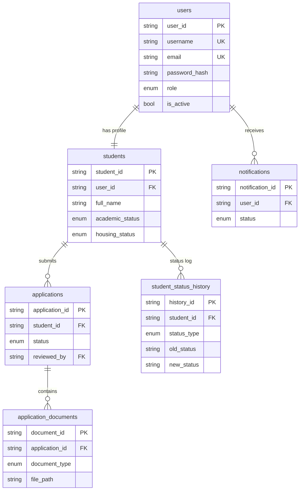
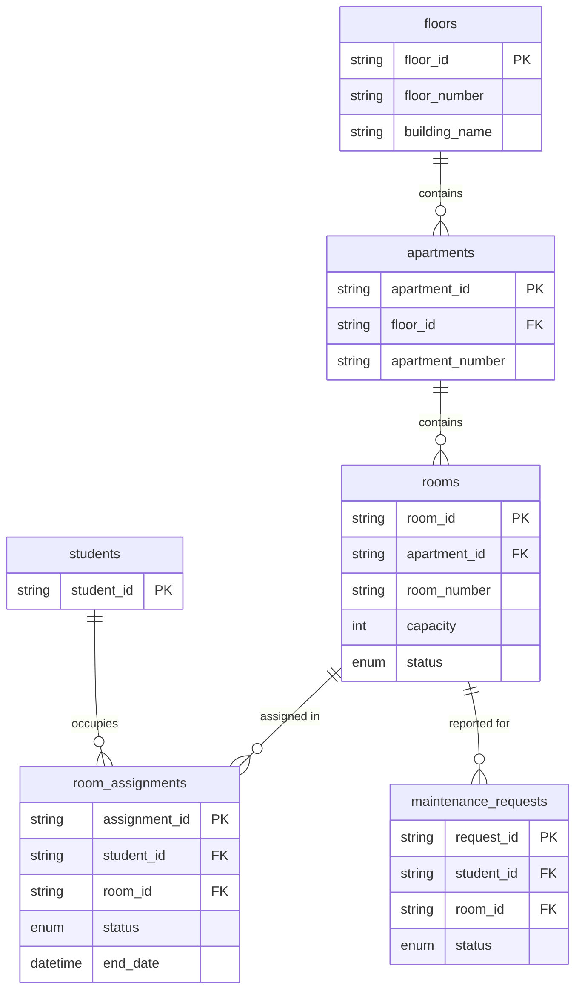
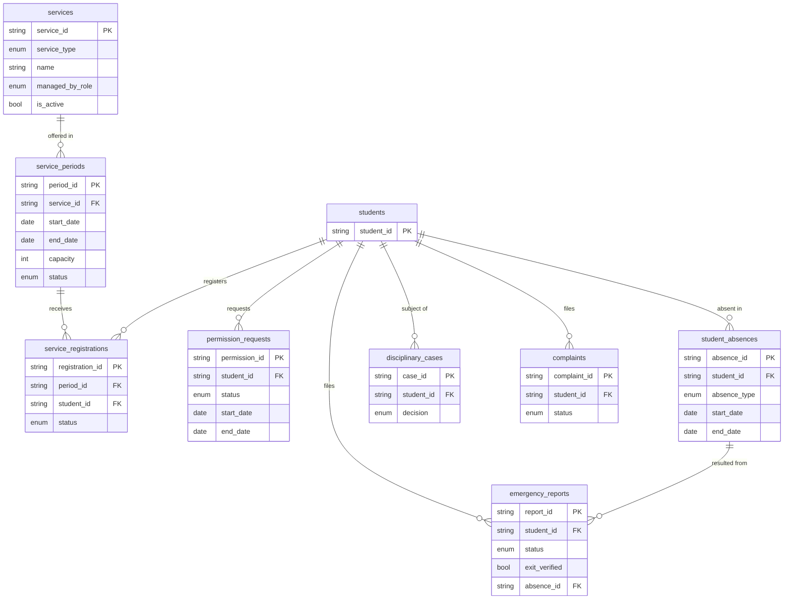
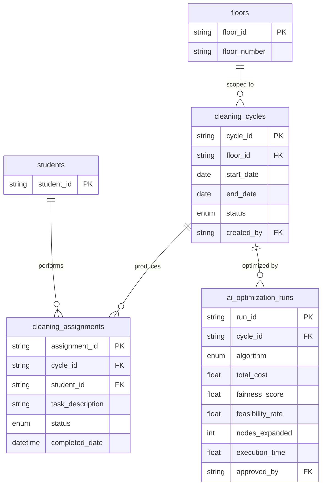

# Database Design — Smart Student Housing Management System

سكن بازرعة الطلابي · MySQL (MariaDB 10.4.21) via XAMPP · InnoDB · `utf8mb4` / `utf8mb4_unicode_ci`

## 1. Conventions

| Rule | Value |
|---|---|
| Primary keys | `VARCHAR(36)` UUID4 string, generated by the application |
| Foreign keys | `VARCHAR(36)`, always indexed |
| Enumerations | MySQL `ENUM`; SQLAlchemy persists the **member name** (snake_case), not the display value |
| Timestamps | naive `DATETIME` holding UTC |
| Dates | `DATE` |
| `ON DELETE` | `CASCADE` for owned children · `SET NULL` for actor references · `RESTRICT` for structural parents |

## 2. Design Decisions — approved 2026-08-30

| # | Decision |
|---|---|
| 1 | Services persistence approved: `services`, `service_periods`, `service_registrations` |
| 2 | `emergency_reports` approved as a table distinct from `student_absences` |
| 3 | `floors` and `apartments` approved as reference tables; `rooms.apartment_id` and `cleaning_cycles.floor_id` become real foreign keys |
| 4 | RBAC remains a fixed role→permission matrix in code; no `roles` / `permissions` tables |
| 5 | Mandatory application documents: National ID, University ID, Enrollment Certificate |
| 6 | Existing enumeration value sets approved unchanged |

**Current total tables: 27** — original domain tables, D2 identity security, and D3 application history.

## 3. Table Inventory

| Domain | Tables |
|---|---|
| Identity | `users` |
| Students | `students`, `student_status_history` |
| Applications | `applications`, `application_documents` |
| Housing | `floors`, `apartments`, `rooms`, `room_assignments` |
| Services | `services`, `service_periods`, `service_registrations`, `permission_requests`, `emergency_reports`, `student_absences` |
| Discipline | `disciplinary_cases` |
| Complaints & Maintenance | `complaints`, `maintenance_requests` |
| Cleaning AI | `cleaning_cycles`, `cleaning_assignments`, `ai_optimization_runs` |
| Notifications | `notifications` |

## 4. Table Definitions

### 4.1 Identity

#### `users`
| Column | Type | Null | Default | Notes |
|---|---|---|---|---|
| `user_id` | VARCHAR(36) | NO | uuid4 | PK |
| `username` | VARCHAR(80) | NO | — | UNIQUE index |
| `email` | VARCHAR(255) | NO | — | UNIQUE index |
| `password_hash` | VARCHAR(255) | NO | — | Argon2id; bounded legacy bcrypt verification |
| `role` | ENUM(user_role) | NO | — | one of the 9 roles |
| `is_active` | BOOLEAN | NO | TRUE | |
| `created_at` | DATETIME | NO | utcnow | |
| `updated_at` | DATETIME | NO | utcnow | on update |
| `auth_version` | INTEGER | NO | 0 | token revocation epoch, CHECK >= 0 |
| `must_change_password` | BOOLEAN | NO | FALSE | forced after admin provisioning/reset |

### 4.2 Students

#### `students`
| Column | Type | Null | Default | Notes |
|---|---|---|---|---|
| `student_id` | VARCHAR(36) | NO | application default | PK |
| `user_id` | VARCHAR(36) | NO | — | FK `users` CASCADE, index, unique |
| `full_name` | VARCHAR(200) | NO | — |  |
| `university` | VARCHAR(200) | NO | — |  |
| `major` | VARCHAR(200) | NO | — |  |
| `academic_status` | ENUM('continuing','graduating','postgraduate','completed') | NO | application default |  |
| `housing_status` | ENUM('active','academic_break','suspended','terminated','applicant') | NO | application default |  |
| `created_at` | DATETIME | NO | application default |  |
| `updated_at` | DATETIME | NO | application default |  |
| `profile_version` | INTEGER | NO | 1 | optimistic concurrency; CHECK >= 1 |

#### `student_status_history`
| Column | Type | Null | Default | Notes |
|---|---|---|---|---|
| `history_id` | VARCHAR(36) | NO | uuid4 | PK |
| `student_id` | VARCHAR(36) | NO | — | FK `students` CASCADE, index |
| `status_type` | ENUM(status_type) | NO | — | Academic / Housing |
| `old_status` | VARCHAR(50) | YES | — | NULL for the first record |
| `new_status` | VARCHAR(50) | NO | — | |
| `start_date` | DATETIME | NO | utcnow | |
| `end_date` | DATETIME | YES | — | NULL while current |
| `changed_by` | VARCHAR(36) | YES | — | FK `users` SET NULL |
| `notes` | TEXT | YES | — | |

### 4.3 Applications

#### `applications`
| Column | Type | Null | Default | Notes |
|---|---|---|---|---|
| `application_id` | VARCHAR(36) | NO | application default | PK |
| `student_id` | VARCHAR(36) | NO | — | FK `students` CASCADE, index |
| `application_date` | DATETIME | NO | application default |  |
| `status` | ENUM('draft','submitted','under_review','pending_documents','accepted','rejected','ready_for_decision') | NO | application default |  |
| `decision_date` | DATETIME | YES | — |  |
| `decision_notes` | TEXT | YES | — |  |
| `reviewed_by` | VARCHAR(36) | YES | — | FK `users` SET NULL |
| `version` | INTEGER | NO | 1 | optimistic concurrency; CHECK >= 1 |
| `submitted_at` | DATETIME | YES | — |  |
| `review_completed_at` | DATETIME | YES | — |  |
| `prechecked_by` | VARCHAR(36) | YES | — | FK `users` SET NULL |
| `review_notes` | TEXT | YES | — |  |
| `requested_documents` | TEXT | NO | '[]' |  |
| `profile_snapshot` | TEXT | YES | — |  |

#### `application_documents`
| Column | Type | Null | Default | Notes |
|---|---|---|---|---|
| `document_id` | VARCHAR(36) | NO | application default | PK |
| `application_id` | VARCHAR(36) | NO | — | FK `applications` CASCADE, index |
| `document_type` | ENUM('national_id','university_id','academic_transcript','enrollment_certificate','medical_certificate','other') | NO | — |  |
| `file_path` | VARCHAR(500) | NO | — | legacy locator; D3 uses db:UUID and never opens this as a filesystem path |
| `uploaded_at` | DATETIME | NO | application default |  |
| `content` | MEDIUMBLOB | YES | — | private DB blob; deferred loading; never included in JSON |
| `content_type` | VARCHAR(100) | YES | — |  |
| `size_bytes` | INTEGER | YES | — |  |
| `sha256` | VARCHAR(64) | YES | — |  |

### 4.4 Housing

#### `floors` — NEW
| Column | Type | Null | Default | Notes |
|---|---|---|---|---|
| `floor_id` | VARCHAR(36) | NO | uuid4 | PK |
| `floor_number` | VARCHAR(20) | NO | — | |
| `building_name` | VARCHAR(100) | NO | — | |

UNIQUE (`building_name`, `floor_number`)

#### `apartments` — NEW
| Column | Type | Null | Default | Notes |
|---|---|---|---|---|
| `apartment_id` | VARCHAR(36) | NO | uuid4 | PK |
| `floor_id` | VARCHAR(36) | NO | — | FK `floors` RESTRICT, index |
| `apartment_number` | VARCHAR(20) | NO | — | |

UNIQUE (`floor_id`, `apartment_number`)

#### `rooms` — MODIFIED (foreign key added, no column change)
| Column | Type | Null | Default | Notes |
|---|---|---|---|---|
| `room_id` | VARCHAR(36) | NO | uuid4 | PK |
| `apartment_id` | VARCHAR(36) | NO | — | **FK `apartments` RESTRICT** (was a bare identifier), index |
| `room_number` | VARCHAR(20) | NO | — | |
| `capacity` | INTEGER | NO | 1 | |
| `status` | ENUM(room_status) | NO | available | |

#### `room_assignments`
| Column | Type | Null | Default | Notes |
|---|---|---|---|---|
| `assignment_id` | VARCHAR(36) | NO | uuid4 | PK |
| `student_id` | VARCHAR(36) | NO | — | FK `students` CASCADE, index |
| `room_id` | VARCHAR(36) | NO | — | FK `rooms` CASCADE, index |
| `assignment_date` | DATETIME | NO | utcnow | |
| `end_date` | DATETIME | YES | — | NULL while active |
| `status` | ENUM(room_assignment_status) | NO | active | |
| `assigned_by` | VARCHAR(36) | YES | — | FK `users` SET NULL |

### 4.5 Services

#### `services` — NEW
| Column | Type | Null | Default | Notes |
|---|---|---|---|---|
| `service_id` | VARCHAR(36) | NO | uuid4 | PK |
| `service_type` | ENUM(service_type) | NO | — | Activity / Food / Sports / Internet |
| `name` | VARCHAR(200) | NO | — | |
| `managed_by_role` | ENUM(user_role) | NO | — | owning officer role |
| `is_active` | BOOLEAN | NO | TRUE | |

#### `service_periods` — NEW
| Column | Type | Null | Default | Notes |
|---|---|---|---|---|
| `period_id` | VARCHAR(36) | NO | uuid4 | PK |
| `service_id` | VARCHAR(36) | NO | — | FK `services` CASCADE, index |
| `start_date` | DATE | NO | — | |
| `end_date` | DATE | NO | — | |
| `capacity` | INTEGER | YES | — | NULL = unlimited |
| `status` | ENUM(service_period_status) | NO | upcoming | |

#### `service_registrations` — NEW
| Column | Type | Null | Default | Notes |
|---|---|---|---|---|
| `registration_id` | VARCHAR(36) | NO | uuid4 | PK |
| `period_id` | VARCHAR(36) | NO | — | FK `service_periods` CASCADE, index |
| `student_id` | VARCHAR(36) | NO | — | FK `students` CASCADE, index |
| `registered_at` | DATETIME | NO | utcnow | |
| `status` | ENUM(service_registration_status) | NO | registered | |

UNIQUE (`period_id`, `student_id`) — enforces business rule 9.2: a student cannot
register for the same service more than once in the same period.

#### `permission_requests`
| Column | Type | Null | Default | Notes |
|---|---|---|---|---|
| `permission_id` | VARCHAR(36) | NO | uuid4 | PK |
| `student_id` | VARCHAR(36) | NO | — | FK `students` CASCADE, index |
| `status` | ENUM(permission_status) | NO | pending | |
| `start_date` | DATE | NO | — | |
| `end_date` | DATE | NO | — | |
| `reason` | TEXT | NO | — | |
| `reviewed_by` | VARCHAR(36) | YES | — | FK `users` SET NULL |

#### `emergency_reports` — NEW
| Column | Type | Null | Default | Notes |
|---|---|---|---|---|
| `report_id` | VARCHAR(36) | NO | uuid4 | PK |
| `student_id` | VARCHAR(36) | NO | — | FK `students` CASCADE, index |
| `reported_at` | DATETIME | NO | utcnow | |
| `description` | TEXT | NO | — | |
| `status` | ENUM(emergency_report_status) | NO | reported | |
| `exit_verified` | BOOLEAN | NO | FALSE | |
| `absence_id` | VARCHAR(36) | YES | — | FK `student_absences` SET NULL, index |
| `handled_by` | VARCHAR(36) | YES | — | FK `users` SET NULL |

A report exists independently of any absence. `absence_id` is populated only after the
exit is verified — this is what makes business rule 9.2 ("not every emergency report
implies an absence") auditable.

#### `student_absences`
| Column | Type | Null | Default | Notes |
|---|---|---|---|---|
| `absence_id` | VARCHAR(36) | NO | uuid4 | PK |
| `student_id` | VARCHAR(36) | NO | — | FK `students` CASCADE, index |
| `absence_type` | ENUM(absence_type) | NO | — | Permission / Emergency / Unauthorized |
| `start_date` | DATE | NO | — | |
| `end_date` | DATE | YES | — | NULL while ongoing |
| `source` | VARCHAR(200) | YES | — | originating permission or report reference |
| `notes` | TEXT | YES | — | |

### 4.6 Discipline

#### `disciplinary_cases`
| Column | Type | Null | Default | Notes |
|---|---|---|---|---|
| `case_id` | VARCHAR(36) | NO | uuid4 | PK |
| `student_id` | VARCHAR(36) | NO | — | FK `students` CASCADE, index |
| `incident_date` | DATE | NO | — | |
| `description` | TEXT | NO | — | |
| `decision` | ENUM(disciplinary_decision) | NO | under_review | |
| `start_date` | DATE | YES | — | suspension start |
| `end_date` | DATE | YES | — | mandatory for Temporary Suspension |
| `decided_by` | VARCHAR(36) | YES | — | FK `users` SET NULL |

### 4.7 Complaints & Maintenance

#### `complaints`
| Column | Type | Null | Default | Notes |
|---|---|---|---|---|
| `complaint_id` | VARCHAR(36) | NO | uuid4 | PK |
| `student_id` | VARCHAR(36) | NO | — | FK `students` CASCADE, index |
| `category` | VARCHAR(100) | NO | — | |
| `description` | TEXT | NO | — | |
| `status` | ENUM(complaint_status) | NO | open | |
| `created_at` | DATETIME | NO | utcnow | |
| `updated_at` | DATETIME | NO | utcnow | on update |
| `handled_by` | VARCHAR(36) | YES | — | FK `users` SET NULL |
| `resolution` | TEXT | YES | — | |

#### `maintenance_requests`
| Column | Type | Null | Default | Notes |
|---|---|---|---|---|
| `request_id` | VARCHAR(36) | NO | uuid4 | PK |
| `student_id` | VARCHAR(36) | NO | — | FK `students` CASCADE, index |
| `room_id` | VARCHAR(36) | YES | — | FK `rooms` SET NULL, index |
| `problem_type` | VARCHAR(100) | NO | — | |
| `description` | TEXT | NO | — | |
| `status` | ENUM(maintenance_status) | NO | pending | |
| `created_at` | DATETIME | NO | utcnow | |
| `updated_at` | DATETIME | NO | utcnow | on update |
| `handled_by` | VARCHAR(36) | YES | — | FK `users` SET NULL |
| `resolution` | TEXT | YES | — | |

### 4.8 Cleaning AI

#### `cleaning_cycles` — MODIFIED (foreign key added, no column change)
| Column | Type | Null | Default | Notes |
|---|---|---|---|---|
| `cycle_id` | VARCHAR(36) | NO | uuid4 | PK |
| `floor_id` | VARCHAR(36) | NO | — | **FK `floors` RESTRICT** (was a bare identifier), index |
| `start_date` | DATE | NO | — | |
| `end_date` | DATE | YES | — | |
| `status` | ENUM(cleaning_cycle_status) | NO | draft | |
| `created_by` | VARCHAR(36) | YES | — | FK `users` SET NULL |

#### `cleaning_assignments`
| Column | Type | Null | Default | Notes |
|---|---|---|---|---|
| `assignment_id` | VARCHAR(36) | NO | uuid4 | PK |
| `cycle_id` | VARCHAR(36) | NO | — | FK `cleaning_cycles` CASCADE, index |
| `student_id` | VARCHAR(36) | NO | — | FK `students` CASCADE, index |
| `task_description` | VARCHAR(500) | NO | — | |
| `assignment_date` | DATE | NO | — | |
| `status` | ENUM(cleaning_assignment_status) | NO | pending | |
| `completed_date` | DATETIME | YES | — | |

#### `ai_optimization_runs`
| Column | Type | Null | Default | Notes |
|---|---|---|---|---|
| `run_id` | VARCHAR(36) | NO | uuid4 | PK |
| `cycle_id` | VARCHAR(36) | NO | — | FK `cleaning_cycles` CASCADE, index |
| `algorithm` | ENUM(ai_algorithm) | NO | — | BFS / A\* |
| `total_cost` | FLOAT | YES | — | Search Cost |
| `fairness_score` | FLOAT | YES | — | |
| `feasibility_rate` | FLOAT | YES | — | |
| `nodes_expanded` | INTEGER | YES | — | |
| `execution_time` | FLOAT | YES | — | seconds |
| `result_summary` | TEXT | YES | — | JSON string of the produced schedule |
| `approved_by` | VARCHAR(36) | YES | — | FK `users` SET NULL — Cleaning Officer |
| `created_at` | DATETIME | NO | utcnow | |

### 4.9 Notifications

#### `notifications`
| Column | Type | Null | Default | Notes |
|---|---|---|---|---|
| `notification_id` | VARCHAR(36) | NO | uuid4 | PK |
| `user_id` | VARCHAR(36) | NO | — | FK `users` CASCADE, index |
| `title` | VARCHAR(300) | NO | — | |
| `message` | TEXT | NO | — | |
| `status` | ENUM(notification_status) | NO | unread | |
| `created_at` | DATETIME | NO | utcnow | |
| `read_at` | DATETIME | YES | — | |

### 4.10 D2 identity security

#### `account_guard`
| Column | Type | Null | Default | Notes |
|---|---|---|---|---|
| `guard_id` | INTEGER | NO | migration seed 1 | PK, CHECK = 1; administrative transaction mutex |

#### `auth_sessions`
| Column | Type | Null | Default | Notes |
|---|---|---|---|---|
| `session_id` | VARCHAR(36) | NO | uuid4 | PK, JWT jti |
| `user_id` | VARCHAR(36) | NO | — | FK `users` RESTRICT, composite index |
| `token_version` | INTEGER | NO | — | auth epoch when issued |
| `created_at` | DATETIME(6) | NO | utcnow | |
| `expires_at` | DATETIME | NO | — | index |
| `revoked_at` | DATETIME | YES | — | NULL while not revoked |

#### `audit_events`
| Column | Type | Null | Default | Notes |
|---|---|---|---|---|
| `event_id` | VARCHAR(36) | NO | uuid4 | PK |
| `actor_id` | VARCHAR(36) | YES | — | FK `users` RESTRICT, index |
| `target_user_id` | VARCHAR(36) | YES | — | FK `users` RESTRICT, index |
| `actor_role` | VARCHAR(60) | YES | — | snapshot |
| `action` | VARCHAR(64) | NO | — | index |
| `details` | TEXT | NO | {} | allowlisted JSON, no passwords/tokens/profile values |
| `created_at` | DATETIME(6) | NO | utcnow | index |

#### `login_rate_buckets`
| Column | Type | Null | Default | Notes |
|---|---|---|---|---|
| `bucket_key` | VARCHAR(64) | NO | — | composite PK, keyed HMAC; no raw IP/username |
| `window_start` | BIGINT | NO | — | composite PK, UTC epoch |
| `attempts` | INTEGER | NO | — | CHECK >= 0 |
| `expires_at` | DATETIME | NO | — | index; eligible for explicit pruning |

### 4.11 Admission history (D3)

#### `application_events`
| Column | Type | Null | Default | Notes |
|---|---|---|---|---|
| `event_id` | VARCHAR(36) | NO | application default | PK |
| `application_id` | VARCHAR(36) | NO | — | FK `applications` RESTRICT, index |
| `actor_id` | VARCHAR(36) | NO | — | FK `users` RESTRICT |
| `actor_role` | VARCHAR(60) | NO | — |  |
| `action` | VARCHAR(64) | NO | — |  |
| `from_status` | VARCHAR(40) | YES | — |  |
| `to_status` | VARCHAR(40) | NO | — |  |
| `note` | TEXT | YES | — |  |
| `application_version` | INTEGER | NO | — |  |
| `created_at` | DATETIME(6) | NO | application default |  |

## 5. Enumeration Value Sets

Approved unchanged (decision 6). SQLAlchemy stores the **name** column in MySQL.

| Enum | Stored names |
|---|---|
| `user_role` | student, housing_administration, student_affairs, maintenance_officer, activity_officer, cleaning_officer, food_officer, sports_officer, system_administrator |
| `academic_status` | continuing, graduating, postgraduate, completed |
| `housing_status` | active, academic_break, suspended, terminated, applicant |
| `application_status` | draft, submitted, under_review, pending_documents, accepted, rejected, ready_for_decision |
| `document_type` | national_id, university_id, academic_transcript, enrollment_certificate, medical_certificate, other |
| `status_type` | academic, housing |
| `room_status` | available, partially_occupied, fully_occupied, maintenance, closed |
| `room_assignment_status` | active, ended, transferred |
| `complaint_status` | open, under_review, resolved, closed |
| `maintenance_status` | pending, assigned, in_progress, resolved, closed |
| `cleaning_cycle_status` | draft, optimizing, pending_approval, approved, active, completed |
| `cleaning_assignment_status` | pending, in_progress, completed, skipped |
| `permission_status` | pending, approved, rejected, cancelled |
| `absence_type` | permission, emergency, unauthorized |
| `notification_status` | unread, read |
| `ai_algorithm` | bfs, astar |
| `disciplinary_decision` | no_action, warning, temporary_suspension, termination, under_review |

### 5.1 Additional approved enumerations

Introduced by decisions 1 and 2; implemented in the ORM and initial migration.

| Enum | Stored names | Display values |
|---|---|---|
| `service_type` | activity, food, sports, internet | Activity / Food / Sports / Internet |
| `service_period_status` | upcoming, open, closed, completed | Upcoming / Open / Closed / Completed |
| `service_registration_status` | registered, cancelled, completed | Registered / Cancelled / Completed |
| `emergency_report_status` | reported, under_review, verified, closed | Reported / Under Review / Verified / Closed |

## 6. Relationships

```text
users                  1 ── 1   students                        (users.user_id, CASCADE)
users                  1 ── N   notifications                   (CASCADE)
students               1 ── N   applications                    (CASCADE)
applications           1 ── N   application_documents           (CASCADE)
students               1 ── N   student_status_history          (CASCADE)
floors                 1 ── N   apartments                      (RESTRICT)      NEW
apartments             1 ── N   rooms                           (RESTRICT)      NEW
rooms                  1 ── N   room_assignments                (CASCADE)
students               1 ── N   room_assignments                (CASCADE)
rooms                  1 ── N   maintenance_requests            (SET NULL)
students               1 ── N   complaints                      (CASCADE)
students               1 ── N   maintenance_requests            (CASCADE)
services               1 ── N   service_periods                 (CASCADE)       NEW
service_periods        1 ── N   service_registrations           (CASCADE)       NEW
students               1 ── N   service_registrations           (CASCADE)       NEW
students               1 ── N   permission_requests             (CASCADE)
students               1 ── N   emergency_reports               (CASCADE)       NEW
student_absences       1 ── N   emergency_reports               (SET NULL)      NEW
students               1 ── N   student_absences                (CASCADE)
students               1 ── N   disciplinary_cases              (CASCADE)
floors                 1 ── N   cleaning_cycles                 (RESTRICT)      NEW
cleaning_cycles        1 ── N   cleaning_assignments            (CASCADE)
students               1 ── N   cleaning_assignments            (CASCADE)
cleaning_cycles        1 ── N   ai_optimization_runs            (CASCADE)

Actor references to users (all SET NULL, nullable):
  applications.reviewed_by · student_status_history.changed_by · room_assignments.assigned_by
  complaints.handled_by · maintenance_requests.handled_by · permission_requests.reviewed_by
  emergency_reports.handled_by · disciplinary_cases.decided_by · cleaning_cycles.created_by
  ai_optimization_runs.approved_by
```

## 7. ERD

Split by domain for readability; together these cover all 22 tables.

### 7.1 Identity, Students, Applications



### 7.2 Housing (with the new `floors` → `apartments` chain)



### 7.3 Services, Permissions, Emergency, Absences, Discipline



### 7.4 Cleaning AI



## 8. Derived Values — no columns added

| Value | Derivation |
|---|---|
| Room occupancy | `COUNT(room_assignments WHERE room_id = ? AND status = 'active')` |
| Room status | maintained by the service layer on assign / end, compared against `rooms.capacity` |
| Students on a floor | `floors → apartments → rooms → room_assignments(active) → students` |
| Student is present | no `student_absences` row covering the date in question |
| Completed this cycle | a `cleaning_assignments` row for the cycle with status `completed` |
| Active suspension | `disciplinary_cases` with decision `temporary_suspension` and today between `start_date` and `end_date` |

## 9. Referential Integrity Policy

| Policy | Applied to | Reason |
|---|---|---|
| `CASCADE` | children owned by a student, application, service, service period, cleaning cycle | the child has no meaning without its parent |
| `SET NULL` | every `*_by` actor column, `maintenance_requests.room_id`, `emergency_reports.absence_id` | deleting a staff account or a room must not destroy the record |
| `RESTRICT` | `apartments.floor_id`, `rooms.apartment_id`, `cleaning_cycles.floor_id` | structural housing data and cleaning history must not be silently deleted |

`RESTRICT` on the three new structural links is a choice, not a specification
requirement — the approved decision named the foreign keys but not their delete
behaviour. Say so if you want `CASCADE` instead.

## 10. Migration Status

The table below records the original author-reported environment. The D1 repair on
2026-09-05 leaves the historical upgrade schema unchanged and fixes index cleanup in
`downgrade()`. See [foundation-d1.md](foundation-d1.md) for independently tested results.

| Item | State |
|---|---|
| Revision `ca98ebed8d42` | extended in place 2026-08-31 to all 22 tables; **applied 2026-08-31** |
| `alembic current` | `ca98ebed8d42 (head)` |
| `alembic heads` | `ca98ebed8d42` (single head) |
| Database `smart_students_home` | 22 tables + `alembic_version`, all InnoDB / `utf8mb4_unicode_ci`, no rows |
| ORM models (PHASE 3) | implemented; `Base.metadata` registers all 22 tables |
| Drift check | `alembic.autogenerate.compare_metadata` returns an empty diff |

The superseded 16-table body of this revision is kept for reference at
`alembic/superseded/ca98ebed8d42_initial_schema_all_16_tables.py`, outside the directory
Alembic scans. Because the revision had never been applied anywhere, extending it in
place produced one coherent initial schema instead of a second revision that would add
foreign keys to columns created moments earlier.

## 11. Open Items and historical artifacts

- Business workflows, retention policy and record-level permissions remain to be implemented.
- `_assemble_revision.py` is retired and refuses to overwrite migrations. Its original source
  is retained at `alembic/superseded/assemble_revision_legacy.py.txt` as non-executable text.
- `_gen_upgrade.txt` and `_gen_downgrade.txt` are historical generator output, not runtime code.
- `_offline_head.sql` is a historical error message, not executable SQL; it does not describe
  the current Alembic head count. Existing local contents were preserved during D1.
- The additional enum sets and the three structural RESTRICT foreign keys are implemented.


## 12. Foundation D1 boundary

The database schema remains 22 tables. Defaults such as UUIDs and timestamps are
application-side defaults, not promises of server defaults for direct SQL callers.
Online migrations preflight InnoDB and utf8mb4/utf8mb4_unicode_ci database defaults.
Password-hash storage width is unchanged; newly stored hashes use Argon2id.
The service-level capacity, dates, state transitions, retention and ownership rules
are not implemented by D1. CASCADE policies remain unchanged pending D2 decisions.

## 13. D2 identity migration

Revision `d2a5c19f0b72` follows `ca98ebed8d42`. It adds two user fields and four
security tables, preserves existing users, and seeds account_guard row 1. D1
tokens are deliberately invalid under D2. Account hard deletion is blocked by
application services/repositories; legacy student-owned CASCADE links remain
unchanged. This is not a claim that a privileged DBA cannot delete data.

## 14. D3 approved admission policy (2026-09-06)

Student Affairs performs review and sends complete requests to Housing Administration for a decision. National ID and enrollment certificate are required; university ID is optional. New profiles start as Applicant, not a housed resident. Approval does not allocate a room. See admissions-d3.md for storage, validation, state/version rules and migration precautions.
